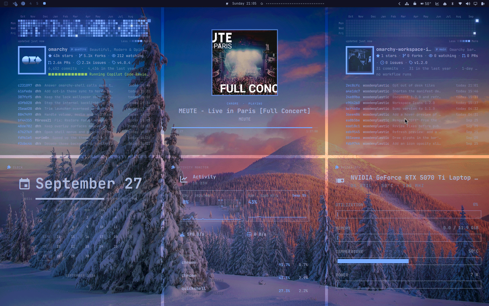

# Information Wallpaper Overlay



**Information on your wallpaper.** Up to six tiles on the desktop, laid out
the way Hyprland tiles windows, each one showing something you'd otherwise
need an app open for:

- **A GitHub repo**, public or private: its numbers, its Actions runs, a year
  of commits and its recent commits.
- **herdr's agents:** which coding agents are working, which are waiting for
  you, and what each one is on.
- **Tasks:** builds, flashing, updates and copies running on the machine,
  and whether they passed.
- **Now playing:** the cover, title, artist and how far into the track.
- **Any installed plugin:** its menu, live, or its own `DeskTile.qml`.
- **A workspace, live:** its windows where they are, as they are right now.

The tiles sit between the wallpaper and your windows, so you see them on an
empty workspace or in the gaps between windows. They never take a click.

## A repo tile

- **A year of commits** as a heatmap, one column per week like on GitHub, with
  month names, Mon/Wed/Fri and a Less–More legend. Today's cell has a frame
  that breathes, and cells with commits twinkle now and then. The animation
  pauses while windows are open on the workspace, and it can be turned off.
- **The repo:** the owner's avatar recolored in the theme's accent, the name,
  a lock for private repos, the branch shown, and the description.
- **Numbers:** stars, forks, watchers, open pull requests and issues, and the
  latest release.
- **The year in numbers:** all commits, commits in the last year, the current
  streak of days with commits, and the busiest day.
- **Actions:** the last twelve workflow runs as colored blocks, newest on the
  right, and the latest run with its result, duration and age. Green means
  passed, red failed, and yellow running, which pulses.
- **Why it failed:** when a workflow's latest run failed, the tile says which
  job and step, and shows the last lines before the error in a red-tinted
  block, as many as fit (the lines that name the trouble first). It's read
  from the run's log once per failed run, not on every fetch, and goes away
  when the workflow passes again.
- **Pull requests:** the newest open ones, up to three as fit, with their
  number, title and author, a block for their checks (green passing, red
  failing, yellow running), whether they have conflicts, the review state and
  how long since they changed. Drafts are dimmed.
- **Commits:** short SHA, author, message and time ("today 15:39"), as many as
  fit the tile. A merge commit shows the pull request it merged.
- **A running workflow** takes the commits' place: the run with its number
  and commit, each job with its state and time, and the steps of the job
  that's running, the current one pulsing. Times count up by the second. When
  the run ends, its result (and a failed job's steps) stays for a minute,
  then the commits come back. Several runs at once take turns. The heatmap and
  the repo above stay where they are.

All of it sits on a soft glow in the accent color, and it scales with the
tile: one repo on the whole screen gets big cells and large type.

## Looks like Omarchy

- The tiles use the theme's background (20% opaque by default) and its
  accent color, and they change along with the theme.
- Run colors come from the theme's green, yellow and red.
- The tiles have no border and reach the screen edges. Between tiles is
  Hyprland's gap, and their corners follow its rounding; with rounding off, the
  heatmap cells are square too.
- One tile fills the screen, two sit side by side, three are one large tile
  beside two stacked ones, four make a 2×2 grid, five are one tall tile
  beside a 2×2 grid, and six make a 3×2 grid. On a portrait monitor the
  splits turn.

## The agents tile

For [herdr](https://herdr.dev) users. The tile asks herdr every two seconds
which agents run in which workspace and what they're doing:

- **The counts:** how many agents are waiting for you, working, done and
  idle.
- **Each workspace** with its agents: the state as a dot, the agent (claude,
  codex, …), what it's on (its terminal title), its folder, and how long it's
  been in that state. The focused workspace is in the accent color.
- **Waiting for you** (an agent that asks for permission or input) shows in
  red and pulses; working agents pulse in yellow; done is green.

Under each agent are the long tasks running in its pane, as the tasks tile
sees them: `idf.py build`, what it's doing now (`compiling wifi_mgr.c`) and
how long it's been running. At most two show per agent, with the rest counted.
A task belongs to an agent when it runs in the agent's herdr pane, which
every program started there carries in `$HERDR_PANE_ID`.

When the agents don't all fit, idle ones are left out first and the rest is
counted at the bottom. Without herdr, or with its server stopped, the tile
says so.

## The tasks tile

Long tasks, wherever they were started: in a terminal, by an agent, from an
editor. Every two seconds the tile looks for known tools among the running
processes and shows each one that has run five seconds:

- **Builds:** `idf.py`, `cmake --build`, `make`, `ninja`, `meson`, `cargo`,
  `gradle`, `mvn`, `go build`, `npm`/`pnpm`/`yarn`/`bun` scripts and installs,
  `tsc`, `vite build`, `next build`, `docker`/`podman build`, `kicad-cli`,
  `pio run`, `arduino-cli`
- **Flashing:** `esptool`, `idf.py flash`, `dfu-util`
- **Updates and installs** that you run: `pacman` and `yay` or `paru`
  changing packages, `makepkg`, `flatpak`, `pip` and `uv` (the tile only
  watches them; it never runs one)
- **Copies:** `rsync`, `dd`, `ffmpeg`, `tar`, `zstd`, `xz`, `7z`,
  `git clone/fetch/pull/push`

Commands that keep running on purpose (`dev`, `serve`, `watch`, `monitor`,
…) are left out. A row shows the task (`idf.py build`, `npm tauri build`),
its project folder, the agent that started it, and while it runs, its busy
jobs, CPU and time; a build's compilers count as its jobs, not as tasks of
their own. **Also watch** in the settings adds your own programs by name.

While there's room, a running task gets a second line:

- **What it's doing now:** `compiling wifi_mgr.c`, `building serde`,
  `linking firmware.elf`, `writing flash`, `indexing objects`, or else the
  name of the program busy under it (`mkinitcpio`).
- **How far along:** a bar measured against how long the same task in the
  same folder took the last three times, with "~3m left", or "over the usual
  3m 12s" once it takes longer. Runs that failed or were cancelled don't
  count, and a task seen for the first time gets no bar.
  The times are kept in
  `~/.local/state/information-wallpaper-overlay/durations.json`.
- **Copies that read one file start to end** (`dd`, `zstd`, `xz`, `ffmpeg`,
  `tar` and `7z` extracting) get a real bar: how far into that file they are,
  how fast they read it, and the time left at that pace ("48%  ·  210 MB/s  ·
  ~2m left"). Reading from a pipe, they fall back to the usual estimate.
- **Its CPU over the last two minutes**, as a small chart of the whole
  machine: a build that uses every core fills it, one stuck on a single core
  stays low.

When the tasks don't all fit, the ended ones are left out first, then the
running ones lose their second line.

The last 20 tasks that ended stay below the running ones, newest first,
and are kept in `~/.local/state/information-wallpaper-overlay/tasks.json`
across restarts: green when it passed, red when it
failed, grey when it was cancelled or it isn't known. A process started
elsewhere doesn't tell how it ended, so that comes from a small hook for
bash: **Pass or fail for terminal commands** adds one line to `~/.bashrc`,
and new terminals note how each command that ran five seconds or longer
ended, to `$XDG_RUNTIME_DIR/information-wallpaper-overlay/`. It works along
with starship and starts no process of its own. Tasks agents start run
outside those terminals, so they end grey; the agents tile tells how the
agents are doing.

## Plugin tiles

**Installed plugin** in a slot's dropdown puts another shell plugin on the
desk: Activity Monitor, Network, NVIDIA, Tailscale, Bluetooth, anything
installed with a bar widget. The plugin doesn't need to know about it.

The tile makes its own copy of the plugin's bar widget and tells it its menu
is open, so the plugin gathers its data as it does for the bar. The menu's
window never shows and never takes the keyboard; what the menu holds moves
into the tile instead, laid out as the plugin lays it out and scaled to fit.
The copy works only while the tile can be seen, gets the bar's look and the
shell's services but none of its popups, and leaves the plugin's IPC to the
real widget. The tile only shows the menu: nothing in it takes a click, a
key or the keyboard focus, on the desktop or on the lock screen, where
plugin tiles work too (with the look but not the bar's services, since
there is no bar). A menu's rows that could end a process or switch a
network can't be reached from the locked screen.

This works for plugins built on the shell's `Panel` and `KeyboardPanel`,
which most are; others say so in the tile. It leans on those two, so a shell
update that changes them may need an update here.

### For plugin authors: `DeskTile.qml`

A plugin can draw its own tile instead: put a `DeskTile.qml` next to its
`manifest.json`. The tile loads it into its padding (on the theme's
background with the accent glow, like every tile) and sets these, where the
file declares them:

- `property bool live`: the tile can be seen; gather data only while it's
  true. The tile never takes input, so a `DeskTile.qml` only shows.
- `property bool animate`: animations are on and the desk is in view.
- `property QtObject bar`: the bar's colors, fonts and `shell` services
  (`bar.shell.firstPartyServiceFor(...)`), without popups.
- `property var settings`: the plugin's own entry in `shell.json`.

It fills the tile's area, so it should lay itself out for any size; the
shell's `Style` and `Color` (`qs.Commons`) give the theme. A plugin with a
`DeskTile.qml` shows that in the tile instead of its menu.

A plugin with nothing worth a tile, say one that is all settings or only
makes sense on the bar, can say so in its `manifest.json`:

```json
"deskTile": { "supported": false, "message": "Workspace Icons belongs on the bar." }
```

It's then left out of the slots' plugin list, and a slot that already shows
it shows the message instead of the menu.

## The workspace tile

**Workspace (live)** shows one workspace as a miniature of its monitor, the
bar's strip left out: each window at its place and size, as a live capture,
tiled ones under floating ones under fullscreen ones, and the app's name
until its first frame. Pick the workspace in the slot's second dropdown:
1 to 10, or a named or special one Hyprland has.

The captures run only while the tile can be seen, at 60 fps: Hyprland draws
windows on hidden workspaces at `misc:render_unfocused_fps` (15 by default),
so while a workspace tile is in view, on the desk or the lock screen, that's
raised to 60 through `hyprctl eval`, and the value before comes back once
none is (`scripts/unfocused-fps` keeps it in `$XDG_RUNTIME_DIR`, so a crash
doesn't lose it either). If you or another tool change it in the meantime,
your value stays. It's a global setting, so windows on other hidden
workspaces render at 60 in that time too. A workspace slot starts out kept off the lock
screen, since anyone there would see its windows; its lock button changes
that.

## The music tile

What the bar's media widget shows: the player playing (Spotify, a browser,
mpv, anything with MPRIS), with the cover, title, artist, album, the player's
name, and a bar with the time. In a tall tile the cover sits above the text.
Paused, the cover dims; with nothing playing, the tile says so.

## The icon

The icon, four tiles, sits in the tray behind its arrow and carries a small
status dot for all repos together:

- green when every workflow's latest run passed
- red when any workflow's latest run failed
- yellow while a workflow runs

Its tooltip also says when agents are waiting for you. Click it for the
settings. Turn off **Show in the tray** to put the icon on
the bar instead, where it pulses while a workflow runs and a middle-click
refreshes right away.

## Settings

The popup holds everything:

- **Slots:** six, one row each. A dropdown picks what the slot shows:
  **GitHub repository**, **herdr agents**, **Tasks**, **Now playing**,
  **Installed plugin** (then which one), **Workspace (live)** (then which
  one) or **Empty**, and any of them in
  as many slots as you like. A repository gets
  its field beside the dropdown: start typing and it suggests your own repos
  and your organizations' repos, most recently pushed first; pick one with
  the mouse, or with the arrow keys and Enter, or type any `owner/repo` or
  paste a GitHub URL. The branch field under it is optional; left empty, the
  tile shows the default branch. Tasks get **Also watch** for your own
  programs (tasks tiles share one watcher, which watches all their lists),
  and the bash hook for pass or fail.
- **The layout** above the slots shows where each filled slot lands. Empty
  slots are skipped, so the filled ones share the desk in slot order; with
  three, the first is the large one.
- **Opacity** of the tiles.
- **Animations:** the twinkling cells, today's breathing frame and the
  pulsing agents.
- **Show in the tray:** the icon behind the tray's arrow, or on the bar.
- **Lock screen:** the tiles on the lock screen too (see below); each
  slot's lock button keeps that tile off it.

## On the lock screen

With the [Lock Screen Explorer](https://github.com/SirJul1337/omarchy-lock-explorer)
plugin installed, the popup gets a **Lock screen** section. **On the lock
screen** adds the overlay as one of the explorer's designs and makes it the
lock screen: the tiles fill the screen as on the desktop, with a card in the
middle for the clock, the date, the CI status, agents waiting for you and the
password field. Turning it off removes the design, and the explorer goes back
to its default. You can also pick it in the explorer, where it's called
"InformationWallpaperOverlay" under Custom.

The lock screen shows what the desktop shows, plugin tiles included, from the
same data; the bar widget keeps fetching while the screen is locked. Anyone at
the locked screen can read it, so each slot has a lock button beside it in the
popup: locked, that tile stays off the lock screen, and the others share its
room there. A private repo or your agents' work can stay on the desktop only.
Nothing in a tile can be clicked or typed into there either.

The tiles fade in once they have something to show, so a fresh lock never
flashes empty tiles. As a Lock Screen Explorer boot screen, which is a
picture taken ahead of time, the design shows the tiles as empty panes and
only the password field in the card: whatever the tiles held would be out of
date by the next boot.

The overlay only writes that design file where no file of that name is, and
only reuses or removes it while it's exactly the file it wrote. A design of
the same name that isn't the plugin's, or that you edited, is left alone;
the popup says so.

The design is `lock/LockDesign.qml` in the plugin.
`~/.config/omarchy/lock-designs/InformationWallpaperOverlay.qml` only points
at it, so plugin updates reach the lock screen without adding it again.

## Requirements

- The [GitHub CLI](https://cli.github.com/) (`gh`), logged in with
  `gh auth login`, for repo tiles. The overlay uses that login, so private
  repos work without a token to set up.
- [herdr](https://herdr.dev), for the agents tile.
- `jq`, `curl` and the system Python's PyGObject (for the tray icon), which
  Omarchy already has.

## Refreshing

The data is fetched every 5 minutes, and every 30 seconds while a workflow is
running. Changing the repos fetches right away.

A run that failed costs one more request, for its log, the first time the
tile sees it; the pull requests come with the repo's other numbers.

Without a network, as early in a boot, a repo tile keeps what the last fetch
got and says "offline" beside its age, and the fetch is tried again every
minute until GitHub answers. A repo that was never fetched says it's offline
in place of its data.

The year of commits comes from GitHub's weekly statistics when GitHub has
them ready, which only covers the default branch. Otherwise it's counted from
the history once and then brought up to date with just the newest commits;
a very busy repo takes a while the first time.

The agents tile asks herdr every two seconds, and the music tile follows the
player as it plays.

The last fetch and the owners' avatars are kept in
`~/.cache/information-wallpaper-overlay/`, readable only by you, so the tiles come back
immediately after a restart.

## Install

```bash
omarchy plugin add https://github.com/woodenplastic/omarchy-information-wallpaper-overlay.git --enable
```

Then click the four-tiles icon (behind the tray's arrow) and pick what each
slot shows.

The tiles only appear on the first monitor, drawn by the widget there. If
you remove the widget from the bar, the tiles go with it.

## Remove

```bash
omarchy plugin remove woodenplastic.information-wallpaper-overlay
rm -rf ~/.cache/information-wallpaper-overlay
```

If it's on the lock screen, turn that off in the popup first, or remove
`~/.config/omarchy/lock-designs/InformationWallpaperOverlay.qml` afterwards.
Turn off **Pass or fail for terminal commands** too, or delete its marked
line from `~/.bashrc`; while the plugin is gone the line does nothing.

The first line removes the plugin and its settings; the second deletes the
cached repo data and avatars.

## Permissions

- **Network:** GitHub's API through your `gh` login (repos, commits, Actions
  runs and jobs, your repo list for the suggestions), and the owners' avatars
  from `avatars.githubusercontent.com`. For a sharp cover, the music tile
  sends the playing track's artist and title to Apple's iTunes Search API
  (`itunes.apple.com`) and, for videos, YouTube's search page, then loads the
  cover from `i.ytimg.com`; nothing else is sent.
- **Files:** writes its settings to `~/.config/omarchy/shell.json` through
  Omarchy's `omarchy-shell-config` helper, only when you change them in the
  popup, and its cache to `~/.cache/information-wallpaper-overlay/`. With the
  lock screen turned on, it writes
  `~/.config/omarchy/lock-designs/InformationWallpaperOverlay.qml`
  and talks to Lock Screen Explorer through `omarchy-shell lock`. With
  **Pass or fail for terminal commands** on, it adds one marked line to
  `~/.bashrc`, and turning it off takes that line out again; the hook notes
  commands' exit statuses in
  `$XDG_RUNTIME_DIR/information-wallpaper-overlay/commands.jsonl`. The tray icons are
  drawn into `$XDG_RUNTIME_DIR/information-wallpaper-overlay-icons/`. The
  tasks tile keeps its last tasks in
  `~/.local/state/information-wallpaper-overlay/tasks.json`.
- **Windows:** the workspace tile reads `hyprctl clients` and `hyprctl
  monitors` and captures that workspace's windows through the compositor,
  only while the tile can be seen. While one is in view it raises Hyprland's
  `misc:render_unfocused_fps` to 60, and restores it after.
- **Processes:** the tasks tile reads command lines, times and CPU from
  `/proc`; it never touches the processes.
- **Commands:** `gh`, `jq`, `curl`, `herdr agent list` and
  `herdr workspace list` (read only), and `hyprctl` to read gaps and rounding
  and the cursor position when the tray icon is clicked.
- **Media:** reads the playing track through the shell's media service
  (MPRIS); it never controls the player.
- No root, no tokens of its own, no telemetry.

## Credits

The heatmap, the sparks and the year in numbers follow the look of
[Commit Wallpaper](https://github.com/zenfoco/omarchy-commit-wallpaper) by
zenfoco.

## License

MIT
